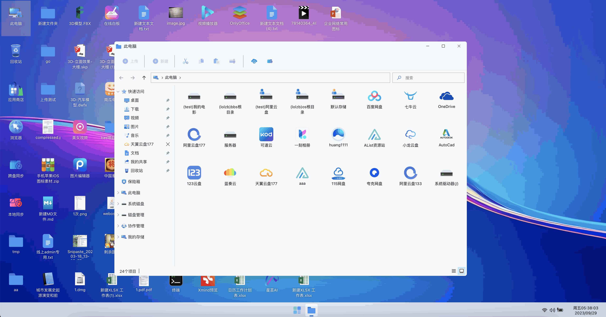

# 腾飞云盘

#### 介绍
腾飞云盘是一款基于<a href="https://tfyun.gitee.io/common/jump.html?url=https%3A%2F%2Fos.tenfell.cn" target="_blank">腾飞Webos</a>打造的个人云盘系统,整体仿制win11的交互效果,支持挂载各类三方网盘,支持各类三方网盘之间秒传复制,备份同步

#### 使用说明
本项目无需部署,无限云盘空间,不限速,注册账号即可免费使用<a href="https://tfyun.gitee.io" target="_blank">戳我开始吧!</a>   
使用效果图如下 

